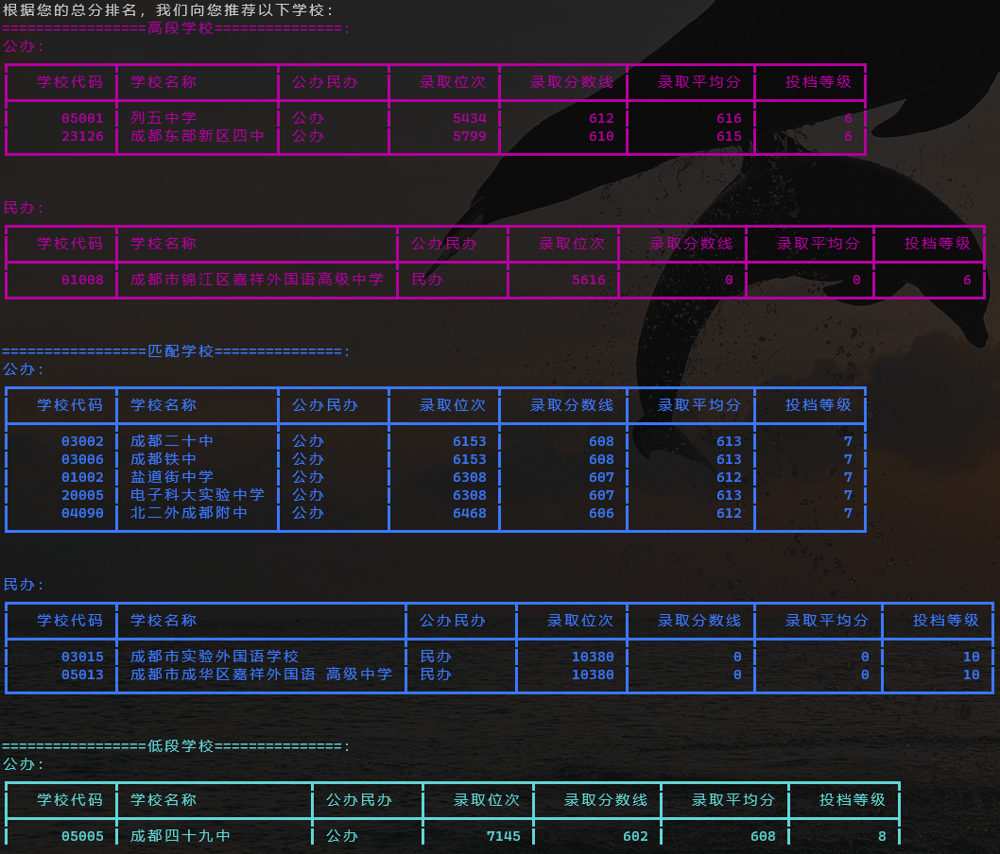
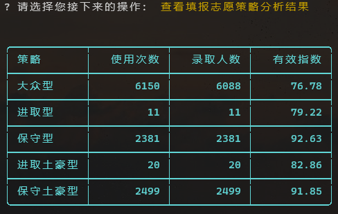
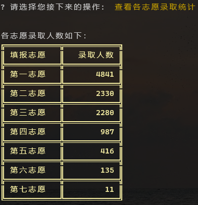

# 成都市中考志愿填报模拟程序
学习中考政策，收集过往数据，通过模拟填报，分析各类填报策略的有效性。
**算法持续改变和改进中。。。**
# 基本流程
本程序假设自己是成都5+2区域统招生身份。模拟过程如下：
1. 输入自己的个人信息。中考考分选择两种生成方式：手动或者电脑随机生成；
2. 随机生成所有考生的成绩，并以此划定重高线；
3. 根据自己的考分排名，电脑给出推荐填报的学校名单；
4. 自己填写7个志愿；
5. 电脑根据每个考生的排名选择不同的填报策略，完成所有考生的志愿填报；
6. 投档；
7. 公布自己的录取结果；
8. 可以继续查看各类统计信息
# 运行
```
git clone git@github.com:panxiao2014/zhongkao.git
pip install -r requirements.txt
python
python zhongkao.py
```
注：如果运行时遇到以下错误：

>File "C:\Python\zhongkao\Lib\site-packages\prompt_toolkit\styles\from_dict.py", line 9, in \<module\>
>
>  from collections import Mapping
>ImportError: cannot import name 'Mapping' from 'collections' (C:\Users\xiaop\AppData\Local\Programs\Python\Python311\Lib\collections\__init__.py)

解决方法是依路径找到**from_dict.py**，将：
```
from collections import Mapping
```
改为：
```
from collections.abc import Mapping
```
# 截图

个人信息：


填报学校推荐：



投档：


学校招收统计：


策略分析：



滑档学生抽查：


各志愿统计：



